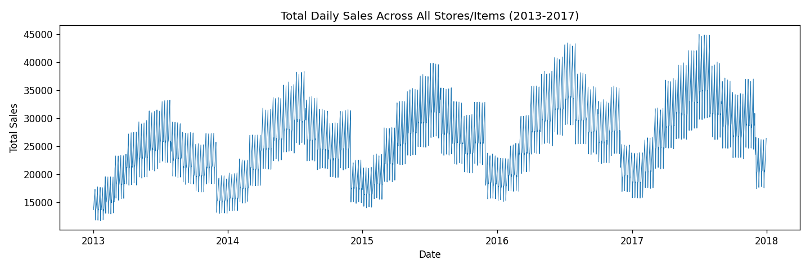
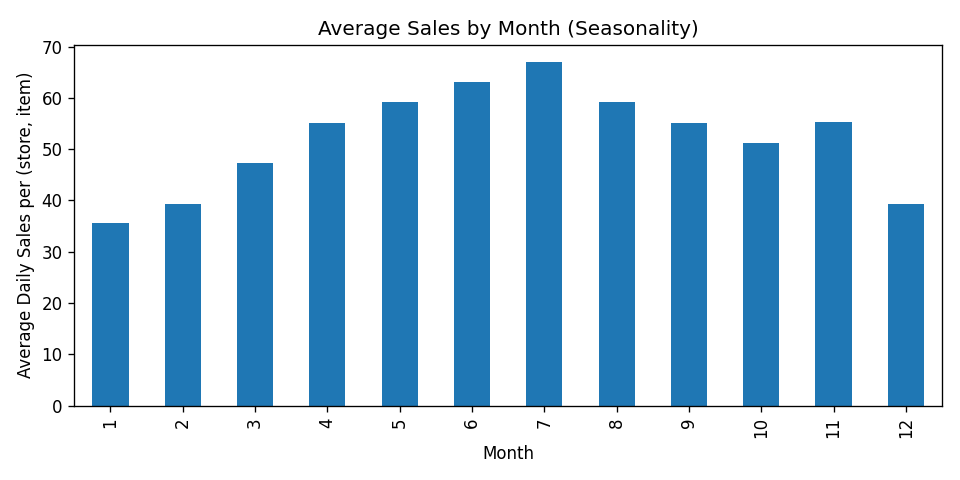
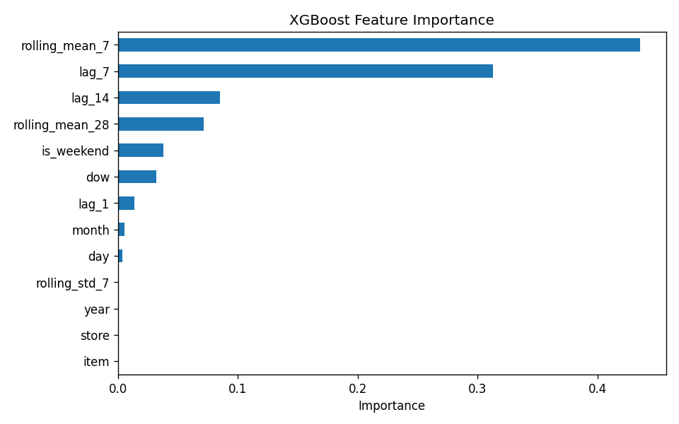
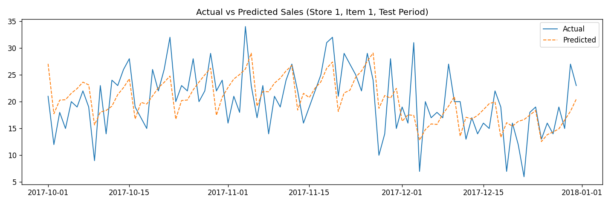

# Retail Sales Forecasting & Demand Analysis

Forecasts daily unit sales per (store, item) using lag-based and rolling-window
features with a gradient-boosted tree model, evaluated against a naive
baseline with a proper time-based train/test split.

## Dataset

[Kaggle Store Item Demand Forecasting Challenge](https://www.kaggle.com/c/demand-forecasting-kernels-only/data) — 913,000 daily records, 10 stores, 50 items, Jan 2013–Dec 2017, no missing values.

**Note:** `train.csv` in this repo is a sampled subset (2 stores × 5 items, ~18,260 rows) to keep the repo small — the analysis and results described here were run on the **full 913,000-row dataset**. Download the full file from the Kaggle link above to reproduce the exact numbers.

## Method

1. **EDA** — daily sales trend, day-of-week effect, monthly seasonality, year-over-year growth
2. **Feature engineering** — lag features (1, 7, 14 days), rolling mean (7, 28 day), rolling std (7 day), calendar features (month, day, day-of-week, weekend flag)
3. **Time-based split** — trained on data before 2017-10-01, tested on the last ~3 months (never a random split — that would leak future data into training for a time series)
4. **Baseline** — naive "predict yesterday's value" forecast, for honest comparison
5. **Model** — gradient-boosted trees (XGBoost)

## Results

Confirmed from the real XGBoost run (see note below on how these were produced):

- **44.5% lower MAE** than the naive baseline (MAE 5.971 vs. 10.755)
- **13.11% MAPE** on held-out future data (Oct–Dec 2017)
- RMSE: 7.730
- `rolling_mean_7` and `lag_7` were the two most important features by a wide margin — recent weekly history predicts tomorrow's sales far better than any single distant lag value or calendar feature alone






## Run it

```bash
pip install pandas numpy xgboost scikit-learn matplotlib
python3 retail_forecasting.py
```

## Note on this repo

`retail_forecasting.py` is the real script (XGBoost) and **the numbers above
are confirmed from that actual run** (not the preview). `preview_with_sklearn.py`
was used only during initial development, in an environment where XGBoost
couldn't be installed (no internet access there) — it substitutes scikit-learn's
HistGradientBoostingRegressor, a similar but not identical algorithm, purely
to validate that the full pipeline (EDA, feature engineering, time-split,
evaluation) ran correctly end-to-end before the real model was run. The two
runs produced very close error metrics (MAE 5.971 real vs. 5.984 preview),
which was a useful sanity check — but feature importance rankings differed
somewhat between the two, since XGBoost's built-in (gain-based) importance
and scikit-learn's permutation importance are different methodologies and
can disagree on correlated features like `lag_7` and `rolling_mean_28`.

## Tech

Python, pandas, XGBoost, scikit-learn, matplotlib
